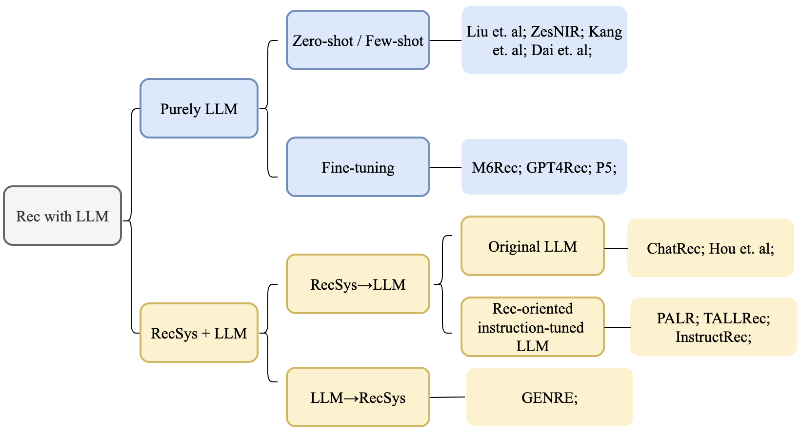

# LLM4Rec

This repository collects papers related to LLM for recommendations. The list is under construction and may not be comprehensive. Feel free to raise issues with related work!

For each paper, we list information including dataset, tasks, baseline, prompts, etc.

## category

Picture credited to Shenghao Yang

### Survey

- Pre-train, Prompt and Recommendation: A Comprehensive Survey of Language Modelling Paradigm Adaptations in Recommender Systems. `arXiv 02.23` [PDF](https://arxiv.org/pdf/2302.03735.pdf)

### purely LLM

- Recommendation as Language Processing (RLP): A Unified Pretrain, Personalized Prompt & Predict Paradigm (P5). `RecSys22` [PDF](https://arxiv.org/pdf/2203.13366.pdf)

- Is ChatGPT a Good Recommender? A Preliminary Study. [PDF](https://arxiv.org/pdf/2304.10149.pdf)

  - Amazon Beauty

  - task: rating prediction, sequential recommendation, direct recommendation. exlpanation generation, review sumarization.

    

- TALLRec: An Effective and Efficient Tuning Framework to Align Large Language Model with Recommendation. [PDF](https://arxiv.org/pdf/2305.00447.pdf)
  - movieLens100k, BookCrossing

- Zero-Shot Next-Item Recommendation using Large Pretrained Language Models. [PDF](https://arxiv.org/pdf/2304.03153.pdf)

  -  MovieLens 100K, GPT-3.

  - Discrete, continuous, hybird template.

  - relevance, emotion, action, utility.

- Prompt Learning for News Recommendation. [PDF](https://arxiv.org/pdf/2304.05263.pdf) *

  - MIND

  - Masked languaged model (VS PLM-based)

- GPT4Rec: A Generative Framework for Personalized Recommendation and User Interests Interpretation. [PDF](https://arxiv.org/pdf/2304.03879.pdf)

  - GPT2 + BM25

  - Amazon Beauty, Amazon Electronics.

- Recommendation as Instruction Following: A Large Language Model Empowered Recommendation Approach. [PDF](https://arxiv.org/pdf/2305.07001.pdf)

  - sequential recommendation, product search, ..., personalized search

  

- Uncovering ChatGPT’s Capabilities in Recommender Systems

- A First Look at LLM-Powered Generative News Recommendation (Tetsuya Sakai) [PDF](https://arxiv.org/pdf/2305.06566.pdf) *

### LLM + RecSys

- Chat-REC: Towards Interactive and Explainable LLMs-Augmented Recommender System. [PDF](https://arxiv.org/pdf/2303.14524.pdf)

  - MovieLens 100k

  - LightFM, LightGCN; MF, Item-KNN VS Chat-Rec

- Large Language Models are Zero-shot rankers for recommender systems

- Recommendation as Instruction Following: A Large Language Model Empowered Recommendation Approach

- Personalized Prompt for Sequential Recommendation. [PDF](https://arxiv.org/pdf/2205.09666.pdf) *